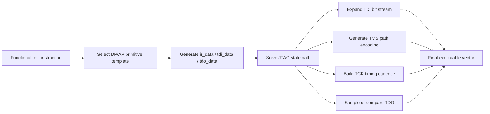

# JTAG State Machine Is Not a Black Box: How TDI / TMS / TCK / TDO Are Actually Derived

This article is the **4th piece** in my engineering series on **JTAG / DFT / ATE / chip test automation / verification infrastructure**.

In the previous two articles, I focused on two core questions:

- **Article 2:** How a functional test instruction can be translated into protocol-level JTAG transaction data through a template layer.
- **Article 3:** Why complex chip test tasks should eventually be reduced to a small set of reusable primitives such as **DP write, DP read, AP write, and AP read**.

This article continues that logic and addresses the next engineering question:

> Once the template layer has already produced `ir_data`, `tdi_data`, and `tdo_data`, why is the vector generation still not finished?

Because what the execution platform finally consumes is **not an abstract transaction description**, but a **bit-level timing sequence**.

In other words:

- the **template layer** answers: **what** should be sent,
- while the **JTAG state-machine driving layer** answers: **how** it is expanded, clocked, aligned, sampled, and executed.

That is why the JTAG state machine should not be treated as a background protocol diagram. In a real automation system, it is the **execution expansion layer** that turns transaction semantics into runnable signal-level vectors.

---

## 1. From article 2 to article 3, and then to this one

The series follows a very clear engineering convergence path.

### Article 2 solved the input abstraction problem

The input should not be a manually crafted waveform.
The input should be a **functional test intent**, including:

- what the task is,
- which address or register is targeted,
- whether it is a read or write,
- what response is expected.

The template layer then translates that intent into protocol-related transaction data.

### Article 3 solved the template boundary problem

Complex test tasks should not directly collapse into raw timing logic.
A stable and reusable abstraction layer is needed between:

- high-level test semantics,
- and low-level signal timing implementation.

That is why **DP/AP read/write primitives** become such a powerful boundary.

### This article solves the execution expansion problem

Even after the template layer has already determined:

- `ir_data`
- `tdi_data`
- `tdo_data`

there is still one crucial step left:

- on which cycle TMS should be `1`,
- on which cycle TMS should be `0`,
- when to enter `Shift-IR`,
- when to enter `Shift-DR`,
- which bit should be driven on TDI at each step,
- when TDO becomes meaningful for sampling or comparison,
- when `Update` should happen,
- and where the transaction boundary really ends.

This is exactly the responsibility of the **JTAG state-machine driving layer**.

---

## 2. Why the template layer is not the final vector layer

A very common misunderstanding is this:

> If the template has already calculated the address, data, direction, and expected return, then hasn’t the vector already been generated?

Not yet.

From an engineering perspective, `ir_data`, `tdi_data`, and `tdo_data` are still only **transaction descriptions**. They are not yet the **discrete timing result** that a tester, pattern engine, or downstream execution chain can consume directly.

The distinction becomes much clearer if we separate the stack into layers:

| Layer | Core question | Output form |
| --- | --- | --- |
| Template layer | What transaction is this? | `ir_data / tdi_data / tdo_data` |
| Driving layer | How is the transaction expanded into bit-level execution? | cycle-by-cycle TDI / TMS / TCK / TDO behavior |
| Vector layer | How is it emitted into pattern / ATE / downstream artifacts? | executable vector payload |

So the template layer and the final vector layer are not the same thing.

The template layer produces **semantic protocol content**.
The driving layer produces a **time-discrete execution sequence**.

That distinction is the foundation of a scalable automation architecture.

---

## 3. What the JTAG state machine really does in an automation system

In textbooks, the JTAG state machine is usually introduced as a protocol diagram.
In an automation platform, however, it behaves more like a:

**bit-level execution expansion engine**.

Its role is far larger than “state transition control.”
In practice, it performs at least three critical jobs.

### 3.1 It converts abstract transactions into executable paths

A register access is never just “write some bits.”
It must travel through a legal execution path, such as:

- starting from an idle or continuation-safe state,
- choosing whether to go through the IR path or the DR path,
- entering capture,
- entering shift,
- shifting data bit by bit,
- exiting shift,
- performing update,
- and returning to a state suitable for the next transaction.

That path is not auxiliary information.
It is part of the generation algorithm itself.

### 3.2 It converts data content into bit ordering on real cycles

The template layer only says what data is needed.
The driving layer must still answer:

- which bit is sent first,
- how many bits are shifted,
- where the last bit lands,
- how the state machine exits after the last bit,
- and whether the tail cycle also carries a state transition.

Bit expansion is therefore not just “printing a bit string.”
It is placing each bit into a state-constrained execution timeline.

### 3.3 It integrates return data into the same execution framework

A test transaction is not only about sending data.
It must also define:

- when TDO should be sampled,
- which bits are meaningful,
- which bits are masked,
- which sampled value belongs to which transaction,
- and how failures should be attributed back to the originating template instance.

So the JTAG state-machine driving layer coordinates:

- transmit timing,
- receive timing,
- transaction boundaries,
- and comparison windows.

That is why it is a core architectural layer, not a disposable implementation detail.

---

## 4. In automation, you do not draw waveforms first. You solve the path first.

A traditional manual mindset often imagines vector generation like this:

1. Decide how the signals should toggle.
2. Draw the waveform.
3. Export the pattern.

A scalable automation system works in the opposite direction:

1. Identify the transaction type from the functional test intent.
2. Generate `ir_data / tdi_data / tdo_data` from the selected primitive template.
3. Solve the JTAG state path required for that transaction.
4. Expand the transaction onto cycle-by-cycle signals along that path.

That flow looks like this:

The most important point is this:

**the state path is itself part of the vector-generation algorithm.**

Without that path, template output cannot become a valid executable sequence.

---

## 5. TDI / TMS / TCK / TDO are not four independent signals

In non-engineering explanations, these four signals are often described separately:

- TMS controls mode selection,
- TDI carries input data,
- TDO carries output data,
- TCK provides the clock.

That description is correct, but incomplete.

In a real generation pipeline, these four signals are **not independently constructed and then glued together**.
They are all projections of the **same transaction execution path**.

### 5.1 TMS is not just a control wire. It is the encoded state path.

At every cycle, TMS determines where the state machine goes next.

So in an automation engine, the first real question is often not “what is TDI?” but rather:

- are we entering the IR path or the DR path,
- when do we move from capture to shift,
- when do we leave shift,
- when does update occur,
- and when do we return to an idle or continuation-safe state?

From the generation perspective, TMS is best understood as:

**the encoded output of the execution path.**

### 5.2 TCK is not a background clock. It is the discrete execution frame.

Without TCK, the state path never lands on a real timeline.
Without TCK, bit delivery and TDO sampling cannot be aligned.

So in automation, TCK is much more than a clock source.
It provides the common cadence that binds together:

- path advancement,
- bit shifting,
- sampling,
- comparison,
- and transaction boundaries.

That is what makes cycle-accurate generation possible.

### 5.3 TDI is not “a value.” It is a bit stream placed into shift windows.

The template says what must be transmitted.
The driving layer still has to determine:

- whether the current phase is IR or DR,
- which bit index is being sent,
- whether the current cycle is still inside shift,
- whether this is the final bit,
- and whether the final bit must also trigger a state exit.

The last bit is often the most delicate one.
Because it is not just the end of the data payload.
It is also often the place where the state-machine phase changes.

That is why many incorrect vectors fail not in the middle, but at the tail cycle.

### 5.4 TDO is not just a returned value. It is part of a closed timing contract.

In simple demos, TDO is often treated as “something read back later.”
In a real automation platform, it must be tied to:

- the expected result from the template layer,
- the valid sampling window,
- masking policy,
- transaction alignment,
- and failure attribution.

So TDO is not an isolated signal.
It only becomes meaningful when it is embedded into the same transaction and timing model as TDI, TMS, and TCK.

---

## 6. The hardest part is not knowing the state names. It is knowing how the system uses them.

Many engineers can memorize names such as:

- `Test-Logic-Reset`
- `Run-Test/Idle`
- `Shift-IR`
- `Shift-DR`
- `Update-IR`
- `Update-DR`

But system design is not about memorizing names.
It is about answering questions like these:

### Does every transaction really need an IR phase first?

Some transactions explicitly load IR.
Some may reuse an already valid instruction context.
That decision depends not only on the protocol, but also on how the generation engine is architected.

### How should IR and DR phases be connected?

At a semantic level, this may sound like “select the operation, then transfer the data.”
At the vector level, it becomes:

- which cycles belong to IR,
- which cycles belong to DR,
- whether transition cycles are required,
- how the tail exit is handled,
- and how the next primitive will continue.

### How should the final bit be handled?

This is one of the most failure-prone places in real implementations.
The final bit is often both:

- the last data bit,
- and the trigger for exiting the current shift state.

If the timing is off, the whole transaction boundary becomes wrong.

### When exactly is TDO valid for comparison?

Not every observed TDO cycle is meaningful.
Without a clear sampling window, alignment rule, and mask strategy, the system will produce either false failures or false passes.

So the engineering challenge is not “knowing JTAG states exist.”
It is:

**turning those states into a stable, reusable generation policy.**

---

## 7. How a primitive template is expanded into real signal behavior

Let us look at the process from an implementation viewpoint.
Suppose the upper layer invokes one primitive, for example:

- one DP read,
- one DP write,
- one AP read,
- or one AP write.

The template layer has already produced three categories of information:

- the required IR meaning for this access,
- the DR payload to be shifted,
- the expected return data or comparison target.

Now the driving layer typically performs the following steps.

### Step 1: determine the transaction semantics

This may sound trivial, but it is not.
Choosing DP vs. AP access is not just choosing a register space.
It defines the operational meaning of the entire downstream execution segment.

### Step 2: solve the state sequence that enters the IR path

The engine does not simply “write IR.”
It first drives the state machine through a legal path toward the IR-related states.

This is where the first wave of cycle-level TMS decisions appears.

### Step 3: expand IR content inside the Shift-IR phase

Now TDI starts to bind to actual bit positions.
During `Shift-IR`, the engine:

- sends instruction bits one by one,
- keeps TCK as the common cadence,
- holds or changes TMS according to whether the phase should continue or exit,
- and marks transaction boundaries more precisely.

### Step 4: switch to the DR path and expand the transaction payload

After the instruction phase is complete, the engine guides the state machine into the DR path.
At this point, the template-generated `tdi_data` becomes a true bit stream on the signal timeline.

For most practical accesses, the DR phase is the actual body of the transaction.

### Step 5: sample or compare TDO inside the valid window

If the transaction expects returned data, the engine must also perform:

- sampling,
- alignment,
- masking,
- and comparison.

This is the point where a protocol transfer becomes a real test feedback loop.

### Step 6: perform exit and update, then close the transaction boundary cleanly

When a primitive ends, it is not enough to say “the bits were sent.”
The engine must also close the boundary properly so that the next primitive can be appended safely.

So a primitive template ultimately produces not just a register operation, but:

**a self-contained, executable, appendable, and comparable vector fragment.**

---

## 8. Why these signals are derived, not manually authored

This is the central point of the article.

In an intuitive manual view, people often imagine vector construction as something like:

- set TMS high here,
- set TDI to this bit there,
- keep toggling TCK,
- and then check TDO.

That picture is too shallow for a real automation platform.

A much more accurate description is this:

### TMS is derived from the state path

First solve the path.
Then encode it cycle by cycle into TMS.

### TDI is derived from transaction content plus bit-order rules

First determine what IR or DR payload the transaction requires.
Then place each bit into the proper shift window.

### TCK is derived from the common cadence model

It is not a separately invented signal.
It is the timing framework that makes the whole execution path discrete and computable.

### TDO is derived from expected results plus sampling policy

The template layer defines what is expected.
The driving layer defines where and how it should be sampled and compared.

That is why TDI / TMS / TCK / TDO are not handwritten artifacts.
They are the result of a coordinated derivation process driven by:

- transaction semantics,
- primitive templates,
- state-path solving,
- bit-order expansion,
- and timing-window control.

---

## 9. Why this layer is easy to ignore, but impossible to skip

In many projects, teams tend to focus on the two ends of the chain:

- whether the upper-layer abstraction looks elegant,
- and whether the downstream artifact can be consumed by a tester or platform.

The middle state-machine driving layer is often underestimated.
Yet it is one of the least skippable layers in the whole system.

Without it, three major problems appear immediately.

### 9.1 The template layer can express intent, but cannot execute it

You may have excellent structured data, but it is still not a runnable vector.

### 9.2 Transaction composition becomes unstable

Without a unified state-path and boundary policy, separate template instances cannot be appended consistently.
What looks manageable in a toy example quickly becomes unmaintainable at project scale.

### 9.3 The downstream chain breaks

Whether the next step is:

- pattern export,
- WGL organization,
- multi-case assembly,
- synthesizable testbench packaging,
- or verification acceleration,

all of them depend on one prerequisite:

**the single transaction must already exist as a stable executable timing unit.**

That prerequisite is established here.

---

## 10. Why this layer is also the bridge to WGL, testbench packaging, and verification infrastructure

Many people think “JTAG vector generation” and “WGL-to-testbench” are separate topics.
Architecturally, they are not.

If we extend the chain, the connection becomes obvious:

1. A functional test task is reduced to primitive templates.
2. Primitive templates are expanded into transaction-level timing fragments.
3. Those fragments are assembled into larger vector units.
4. Those vector units are emitted into pattern, WGL, or other execution-oriented representations.
5. Downstream flows can then package them into synthesizable testbenches, clock-managed execution shells, or acceleration-friendly verification assets.

So the JTAG state-machine driving layer is not just “protocol implementation.”
It is the first hard landing point where test semantics become execution material.

That is why it naturally connects the earlier articles about templates with later discussions about WGL, testbench packaging, and verification throughput.

---

## 11. What is really worth standardizing: not one vector, but the expansion capability itself

In many teams, early reuse is often built around:

- one proven vector sequence,
- one project-specific register script,
- or one manually validated waveform snippet.

These artifacts may help locally, but their reuse boundary is usually narrow.

What is much more valuable to standardize are these three capabilities:

### 11.1 Transaction abstraction capability

This answers:

**How should a functional test task be mapped into protocol transactions?**

### 11.2 State expansion capability

This answers:

**How should a protocol transaction be expanded into bit-level execution timing?**

### 11.3 Output organization capability

This answers:

**How should bit-level timing be emitted into platform-consumable artifacts?**

When these three layers are connected, a much wider range of test scenarios becomes reusable.
When only the final vectors are accumulated, teams usually fall into repeated copying, repeated patching, and repeated alignment work.

The true engineering value is not in storing more waveform fragments.
It is in turning:

- path solving,
- bit expansion,
- transaction boundary control,
- and timing organization

into a stable system capability.

---

## 12. Conclusion

The core question of this article was:

> Why is vector generation still not complete after the template layer has already produced `ir_data`, `tdi_data`, and `tdo_data`?

Because those objects are still transaction-level descriptions, not bit-level executable timing.

A usable test vector must still pass through a JTAG state-machine driving layer that turns the transaction into:

- a cycle-accurate TMS path,
- a bit-accurate TDI stream,
- a discrete TCK cadence,
- and a valid TDO sampling and comparison window.

So the JTAG state machine is not just a diagram that “belongs in the protocol section.”
In a real automation system, it is the **execution engine** that converts template semantics into interface timing.

That is why TDI / TMS / TCK / TDO are not simply written down.
They are derived, step by step, from:

- functional test intent,
- primitive template abstraction,
- state-path solving,
- bit-level expansion,
- and timing-window organization.

Once this point becomes clear, the JTAG state machine stops being background knowledge and becomes what it really is in engineering practice:

**one of the most important layers in test vector automation.**

---

## Suggested next article in the series

A natural continuation would be:

**Why verification throughput improves when multiple WGL cases are reorganized into one synthesizable testbench**

That topic connects cleanly with this article:

- this article explains how a single transaction becomes a bit-level executable unit,
- the next one can explain how many such units are reorganized into a larger and faster execution carrier.
