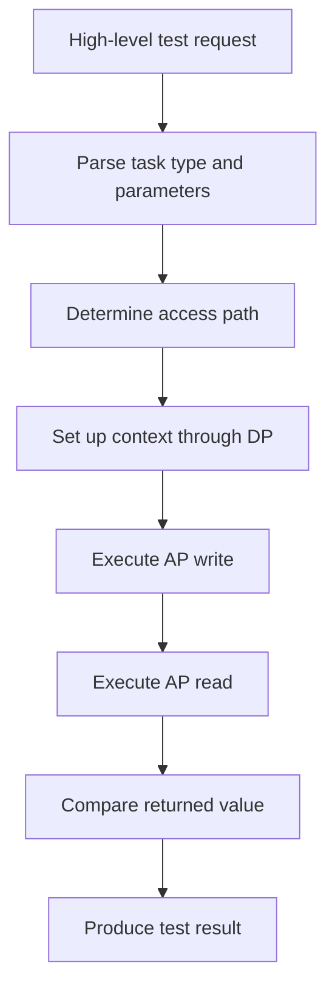
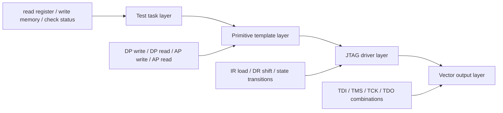

# Breaking Chip Test Tasks into Primitive Templates: Why DP/AP Read and Write Are the Right Abstractions

In the previous article, I discussed a larger systems question:

**Why should functional test generation move from ad-hoc scripting to a template-driven flow?**

That article focused on the overall method.

This article goes one level deeper and addresses a more structural question:

**When building a JTAG-based chip test automation system, why is it so important to reduce complex tasks into a small set of primitive DP/AP read-write templates?**

This is not just an implementation detail.
It is a design decision that determines whether a solution remains a collection of scripts, or evolves into a reusable test infrastructure.

---

## 1. The problem with task-by-task hardcoding

A common early-stage approach in chip functional test automation looks like this:

- one new test requirement, one new script
- one new access pattern, one more helper function
- one new register path, one more special-case routine
- one new module, one more copied-and-modified flow

This works for a while.
But once the project grows, the weaknesses become obvious.

### Script count grows faster than real capability

Soon the codebase is full of functions like:

- `jtag_read_xxx`
- `jtag_write_xxx`
- `ahb_access_xxx`
- `debug_reg_xxx`
- `dap_xxx`

They look different at the task level, but many of them are doing nearly the same thing at the protocol level.

### Maintenance becomes fragile

When requirements change, engineers have to edit many places:

- address handling
- read/write switching
- expected data formatting
- state transition order
- bit-field concatenation

At some point, the system still runs, but nobody wants to touch it.

### Reuse gets worse over time

Without a stable intermediate abstraction, automation becomes “semi-automatic” in the worst way:

- partly reusable
- heavily person-dependent
- hard to extend
- difficult to validate systematically

So the real question is not:

**Can we encode more tasks?**

The real question is:

**Can we reduce many tasks into the same small set of reusable primitives?**

---

## 2. A scalable automation system needs fewer primitives, not more task names

A mature engineering system is not defined by the number of top-level functions it exposes.
It is defined by whether a small set of stable primitives can generate a large set of higher-level behaviors.

That principle applies directly to chip test automation.

For JTAG-based debug and access flows, a surprisingly large amount of functionality can be reduced to four primitive operations:

- DP write
- DP read
- AP write
- AP read

This is important because these four are not just “common functions.”
They are the right intermediate-level abstraction between:

- high-level test intent
- low-level bit-level signal generation

That makes them strong candidates for the internal contract of a test generation framework.

---

## 3. Why DP and AP naturally form the right boundary

A useful engineering interpretation is:

### DP as the debug-entry/control layer

DP is closer to the control side of the debug access path.
It is typically responsible for things like:

- entering and controlling debug access
- maintaining basic control/status interaction
- setting up access context for subsequent operations
- handling some low-level direct register transactions

### AP as the resource-access layer

AP is closer to the layer that reaches actual target resources.
It is usually responsible for:

- accessing system-visible resources
- bridging toward bus-level or register-level transactions
- translating debug transactions into resource interactions

So in practice:

- **DP helps establish and control the access path**
- **AP helps reach the target resource**

A large number of “complex test tasks” are therefore just ordered combinations of DP and AP operations.

---

## 4. Why these four primitives are not just frequent, but fundamental

It is easy to misunderstand DP/AP read-write templates as merely “often used helper functions.”
That misses the real point.

They matter because they form a reusable closure for a large class of tasks.

Let us look at three layers of abstraction:

| Layer | Typical Content | Suitable as Base Template? |
|---|---|---|
| Task layer | read a register, write memory, check module status | No |
| Transaction layer | DP write, DP read, AP write, AP read | Yes |
| Bit timing layer | TDI/TMS/TCK/TDO bit shifts | Too low |

If you place the abstraction too high, reuse becomes weak.
If you place it too low, the system becomes painful to understand and maintain.

The transaction layer is the sweet spot.
That is why DP/AP read-write is the right abstraction boundary.

---

## 5. How a higher-level task collapses into DP/AP templates

Suppose the high-level requirement is:

> Access a target resource through the debug chain, write a value, then read it back for verification.

At the task level, this sounds like one resource operation.
But when decomposed, it often becomes something like:

If we inspect the sequence more carefully, we often find:

- one or more **DP writes** to configure context
- one or more **AP writes** to send data
- one or more **AP reads** to retrieve data
- sometimes **DP reads** for state checking or setup validation

So a seemingly high-level test action is often just:

**an ordered composition of primitive DP/AP templates**

This is why the templates are not an implementation convenience.
They are the core protocol vocabulary of the system.

---

## 6. Why bus access and register access can still be reduced to DP/AP primitives

One of the most useful engineering observations is this:

Higher-level accesses may look different at the functional level, but they often do not require new fundamental low-level primitives.

For example, AHB access, register access, and status inspection may differ in:

- address parameters
- payload values
- expected return data
- access sequence
- verification rules

But if they all ultimately travel through the same debug-access structure, then the better design is usually:

- add semantics at the upper layer
- add mapping logic in the middle layer
- keep the lower primitive set stable

In other words:

**what changes is usually the parameterization, not the primitive category**

That is one of the clearest signals that a system has platform potential.

---

## 7. Why read and write should remain separate templates

Some designs merge everything into a single generic `access(...)` abstraction.
Technically that can work.
But from an engineering standpoint, keeping read and write separate is usually cleaner.

Why?
Because they do not behave symmetrically in a test system.

### Write emphasizes stimulus delivery

A write template is mainly concerned with:

- which value is sent
- how the address is encoded
- how control bits are assembled
- when the write is considered valid

### Read emphasizes result acquisition and checking

A read template is usually concerned with more than just requesting data:

- collecting returned bits
- organizing expected values
- handling comparison rules
- linking to TDO observation
- supporting error diagnosis

So in practice:

- write is not just “read flag = 0”
- read is not just “read flag = 1”

They deserve separate base-template identities.
That is why the four-template set remains a strong design choice:

- DP write
- DP read
- AP write
- AP read

---

## 8. Templates should output protocol transaction data, not human-readable descriptions

Another common misunderstanding is that templates are just textual descriptions of a task.

In a real implementation, the template layer should generate protocol transaction data such as:

- `ir_data`
- `tdi_data`
- `tdo_data`

That means the template layer acts as a **protocol transaction constructor**.
Its job is to determine:

1. which transaction category is being performed
2. which IR value should be loaded
3. how DR-side fields should be assembled
4. how expected return data should be organized

So the template layer is not documentation.
It is executable structure.

---

## 9. Why intermediate variables matter more than people think

When engineers discuss template systems, they often focus only on the final outputs.

But a practical template system is heavily influenced by how well its intermediate variables are designed.

Intermediate variables are valuable because they separate:

- business-facing task parameters
- protocol-facing field construction

They provide three major benefits:

### They decouple task intent from protocol assembly

The upper layer may provide:

- address
- write data
- expected read value

The lower layer may require:

- encoded fields
- concatenated bit sequences
- transaction-specific packing rules

Intermediate variables bridge the two.

### They stabilize templates

If field order or protocol details change later, the mapping logic can be updated without redesigning the full task interface.

### They improve reuse

The same AP-read template can be reused across many scenarios as long as the parameters change cleanly.

This is one of the foundations of parameterized template design.

---

## 10. Why the template boundary should not be pushed all the way down to TDI/TMS/TCK/TDO

A natural question is:

If the final output is bit-level signals, should the base templates be defined directly at the bit-timing level?

Usually the answer is no.

### Reason 1: readability collapses

If a task is represented directly as:

- cycle 1: `TMS = 1`
- cycle 2: `TMS = 1`
- cycle 3: enter `Capture-IR`
- cycle 4: enter `Shift-IR`
- cycle 5: shift one bit
- cycle 6: shift the next bit

then implementation detail has replaced protocol abstraction.
The system may still run, but it becomes much harder to maintain.

### Reason 2: responsibilities get mixed

The template layer should answer:

**what transaction to send**

The driver layer should answer:

**how to send it through the JTAG state machine**

Once those are mixed together, reuse and stability both suffer.

---

## 11. Why the abstraction should also not stay at the business-task level

At the opposite extreme, it is also a mistake to define base templates directly as business tasks such as:

- `test_memory_block_A`
- `check_module_status_B`
- `verify_component_C`

These are useful as upper-layer task names, but not as foundational templates.

Why not?

- business names change quickly
- reuse becomes weak
- every new scenario tends to create another template
- the system gets bound to current tasks instead of protocol structure

The best boundary is therefore still the same one:

**below high-level task semantics, above bit-level timing control**

That is exactly where DP/AP read-write resides.

---

## 12. A layered view of the system

A practical system can be understood as four layers:

In this structure:

- the task layer defines **what to do**
- the primitive template layer defines **how to reduce it into reusable protocol operations**
- the driver layer defines **how to execute those operations through JTAG state transitions**
- the output layer defines **how final vectors are emitted for simulation or platform use**

The second layer is the most important one from a platform-design perspective.
If that layer is wrong, the entire system becomes harder to scale.
If that layer is right, everything downstream becomes more stable.

---

## 13. DP/AP templates are not the end of the system — they are its internal contract

It is important to understand that the four primitive templates do not limit the system.
They enable it.

They act as the internal contract between layers:

- upper layers only need to know how to compose them
- lower layers only need to know how to consume their outputs
- each side can evolve with limited coupling

That provides major engineering benefits:

### Easier extension at the task layer

New scenarios should first be analyzed as combinations of existing primitives.

### Better stability at the driver layer

The JTAG driver does not need to know whether the upper request is for SRAM validation or debug-component access.
It only needs to know:

- DP or AP
- read or write
- IR/DR-related data organization

### Cleaner collaboration boundaries

- task designers work on test semantics
- template designers work on transaction mapping
- driver developers work on state-machine execution

That is how a reusable infrastructure starts to emerge.

---

## 14. Why this abstraction is valuable beyond one implementation

If an engineer only writes a few scripts that make one task run, that is useful — but limited.

If the engineer identifies:

- the smallest reusable protocol primitives
- the right abstraction boundary
- the contract between task intent and JTAG execution
- the path from functional test intent to reusable infrastructure

then the work becomes much more valuable.

It becomes:

- automation method design
- protocol-aware infrastructure design
- vector-generation system architecture
- scalable verification enablement

That is why this topic deserves a dedicated article.
It is not about a few helper functions.
It is about where a test automation system should place its most important abstraction boundary.

---

## 15. Final takeaway

Many automation systems become harder to scale not because the engineers are not capable, but because the system never found the right base abstraction.

In JTAG-centered debug and access flows, DP write, DP read, AP write, and AP read are powerful precisely because they are:

- primitive enough
- stable enough
- expressive enough
- close enough to protocol reality
- yet still above bit-level execution detail

That makes them the right building blocks for reducing complex chip test tasks into a reusable internal representation.

In the next article, I will continue downward and discuss:

**How `ir_data`, `tdi_data`, and `tdo_data` are turned into actual TDI/TMS/TCK/TDO sequences through the JTAG state machine.**

That is where the abstraction meets execution.

---

## Suggested tags

`JTAG` `DFT` `ATE` `Chip Testing` `Debug Port` `Access Port` `Test Automation` `Verification Infrastructure` `EDA` `Semiconductor`
