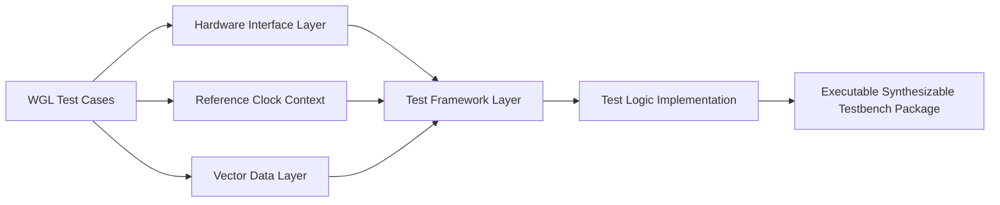

# What Are the Core Building Blocks of a Synthesizable Testbench?

In the previous article, I focused on a practical question that matters a lot in large-scale verification flows:

**Why does merging multiple WGL files into one synthesizable testbench improve verification throughput so much?**

The key conclusion was straightforward:

> The real benefit is not just “fewer files.” It is the shift from treating each pattern as an isolated execution unit to treating verification as a reusable execution framework.

That naturally leads to the next question:

**What exactly makes up a synthesizable testbench in an engineering-grade flow?**

Many engineers first encountering this topic tend to think of it in a simplified way:

> A synthesizable testbench is just a Verilog testbench generated from WGL.

That view is understandable, but it is incomplete.

In practice, a synthesizable testbench is usually **not a single file**. It is a **structured package of files with clearly separated responsibilities**. What matters is not only that a testbench can be generated, but that its internal architecture supports:

- multi-pattern execution
- reuse across test cases
- stable compilation boundaries
- clean separation between data and execution logic
- future extension to timing alignment, bidirectional pins, and acceleration flows

So this article is not a file-by-file user manual. Instead, I want to explain the problem from an infrastructure perspective:

**Why does a synthesizable testbench need to be layered, what does each layer carry, and why does that structure determine whether the platform scales or collapses?**

---

## 1. A synthesizable testbench is not just code. It is an execution framework.

Let us start from the engineering viewpoint.

A synthesizable testbench is not merely a piece of HDL that drives a DUT. In a practical flow, it has to answer several questions at the same time:

- How is the DUT connected?
- How are clocks described and selected per test case?
- Where is vector data stored?
- Which layer defines the static structure?
- Which layer performs runtime control?
- How can one framework execute multiple test cases without rebuilding everything?

Once the problem is framed this way, the role of each file becomes much clearer.

What the flow really needs is not “a generated file,” but a **verification execution model** with clear separation between:

- structure
- data
- context
- control
- comparison behavior

That is why a real synthesizable testbench package is fundamentally a layered system.

---

## 2. The five essential building blocks

From an engineering perspective, a synthesizable testbench package can be decomposed into at least five essential parts:

1. **Hardware interface file**
2. **Reference clock record file**
3. **Vector files**
4. **Test framework file**
5. **Test logic implementation file**

In a typical flow, these roles may correspond to artifacts such as:

- `hw.v`
- `freeclk.txt`
- `input.txt` / `output.txt`
- `ate.v`
- `ate_tb.v`

The important point is not the exact file names. The important point is the **responsibility split**.

A concise way to understand the system is this:

- the **hardware interface file** defines how the DUT is brought into the platform
- the **reference clock record file** defines the execution context of each test case
- the **vector files** carry test data
- the **test framework file** defines the structural skeleton
- the **test logic implementation file** turns the whole system into an executable engine

This is not just file splitting. It is architectural splitting.

---

## 3. The hardware interface file defines the platform boundary

At first glance, a file like `hw.v` may look like a simple DUT instantiation wrapper.

That is true at the syntax level, but not at the architectural level.

### Why this layer matters

The first question any reusable verification framework must answer is:

**What exactly is the system under test, and through which signals does the platform interact with it?**

In a multi-pattern environment, different WGL files may cover different subsets of pins. If the interface layer is defined only from the perspective of one pattern, the structure quickly becomes unstable.

A proper hardware interface layer does two important things:

1. **collects the superset of pins involved across all relevant test cases**
2. **provides a stable DUT integration boundary for the rest of the framework**

This means the file is not just a wrapper. It is the place where the platform defines its static connection model.

### Why separation improves reuse

If the DUT connection model is isolated and stabilized, many future changes do **not** require touching the structural boundary of the framework.

That is critical for throughput-oriented verification flows.

Otherwise, every time a new pattern adds or changes signal usage, the top-level structure has to be reworked. The result is not a platform, but a growing pile of special cases.

So the hardware interface file is best understood as the **static structure layer** of the synthesizable testbench.

---

## 4. The reference clock record file defines per-test-case execution context

This layer is often underestimated.

Many engineers initially see a clock record file as a convenience file or some kind of configuration dump. But in a multi-pattern flow, it plays a much deeper role.

### Why clock information should not be hard-coded into execution logic

If there is only one test case, hard-coding clock behavior inside the testbench may seem acceptable.

But once multiple WGL files are merged, the following problems appear immediately:

- different test cases may use different reference clocks
- the same reference clock may be used at different frequencies across test cases
- some patterns may use only a subset of the available clocks
- future extension may require more clock combinations or timing modes

If all of this is embedded directly in execution logic, the runtime layer becomes increasingly pattern-specific.

That destroys reuse.

### What this file really stores

The reference clock record file should be understood as a **context layer**.

It records, per test case:

- which reference clocks are used
- which frequency selections are active
- how the current test case should be interpreted by the runtime logic

This is important because it allows the execution engine to stay generic.

Instead of hard-coding pattern-specific clock behavior, the logic can read a compact context description and configure execution dynamically.

### Why this matters

This layer is what allows **one framework to execute many test cases** without rewriting the testbench structure every time.

That makes the reference clock record file far more than a helper file. It is part of the runtime dispatch model.

---

## 5. The vector files are the data plane of the testbench

Where is the actual test content stored?

Not in the structural HDL.

It belongs in the vector files.

This separation is fundamental.

A synthesizable testbench only becomes scalable when **structure stays stable while data remains replaceable**.

### Why vectors must be externalized

Vector content is data, not structure.

If vector content is embedded directly into synthesizable execution logic, several problems appear quickly:

- every data change becomes a code change
- the codebase bloats as test volume grows
- maintenance becomes harder
- compilation boundaries become less stable

That is why vector files should be treated as an explicit data layer.

### Why input and output vectors are usually separated

A good execution flow distinguishes clearly between:

- **what the framework should drive**
- **what the framework expects to observe**

That is why a practical system often separates:

- `input.txt`
- `output.txt`

The input side describes stimulus organization.
The output side describes expected values and validity information.

This becomes especially important when the flow needs to support:

- invalid bits
- unknown values
- direction changes
- selective comparisons
- pattern switching

### The vector files are not plain text dumps

From an execution-model perspective, they usually carry more than raw bit values. They often encode control semantics such as:

- test case ID
- vector ordering
- end-of-test-case markers
- total cycle count
- per-pin validity
- output value validity

That means the vector files are effectively an **execution data protocol**.

This layer largely determines whether the platform is truly **data-driven**.

A reusable framework should aim for this principle:

> Write the logic once. Change the data many times.

The vector layer is what makes that principle operational.

---

## 6. The test framework file provides the structural skeleton

So far, we have separated:

- DUT interface
- clock context
- vector data

But these pieces still need to be organized into one coherent structure.

That is the role of the **test framework file**, often represented by something like `ate.v`.

### What this layer really does

The framework layer is not where all detailed runtime behavior should live. Its primary role is to define the structural organization of the system:

- signal connectivity
- module relationships
- integration points
- structural routing between interface, data, and runtime logic

It is best viewed as the **skeleton layer**.

### Why this layer cannot simply be skipped

Without a dedicated framework layer, structure and behavior tend to get mixed together at the top level. The result is familiar to anyone who has seen verification code deteriorate over time:

- top-level files become overloaded
- clocking, reset, vector dispatch, and compare logic get tangled together
- adding new capabilities becomes increasingly painful
- maintenance cost rises faster than pattern count

A dedicated framework layer prevents that by fixing the high-level structural form before detailed runtime behavior is added.

So this layer answers the question:

**What does the system look like structurally?**

It should not also try to answer every runtime question.

---

## 7. The test logic implementation file is the execution engine

This is the layer where the testbench stops being a package of files and becomes an actual executable system.

In many flows, this is the role played by something like `ate_tb.v`.

If the framework layer builds the skeleton, the logic implementation layer makes that skeleton move.

### Typical responsibilities of this layer

This layer usually carries runtime behavior such as:

- clock frequency selection and timing control
- vector fetch and sequencing
- stimulus application
- expected-result comparison
- test-case advancement
- completion detection
- counter control
- offset-pulse generation
- reset and state progression

In other words:

- previous layers provide **resources and structure**
- this layer provides **runtime behavior**

### Why it should stay separate from the framework layer

Because structure and behavior are different concerns.

As soon as the framework layer becomes overloaded with runtime control, the architecture loses clarity. This becomes even worse once the flow starts to support more advanced capabilities such as:

- multi-test-case sequential execution
- timing precision alignment
- per-pin offset control
- bidirectional direction changes
- valid-bit-aware comparison
- error localization and reporting

All of those belong to the **execution engine**, not the structural skeleton.

That is why the logic implementation file is arguably the part of the package that most closely resembles a **runtime engine for verification execution**.

---

## 8. Why these five parts should not be collapsed into one file

A common question is:

**If all of this eventually runs together, why not just put everything into one big testbench file?**

In principle, that is possible.
In practice, it is a bad trade.

### What goes wrong in a monolithic design

When interface definition, clock context, vector data, framework structure, and execution logic are all mixed together, the usual consequences are:

- interface definition becomes coupled to pattern data
- clock behavior becomes pattern-specific code
- drive logic and compare logic become tangled
- adding patterns expands the modification scope continuously
- support for timing offsets and bidirectional pins becomes painful

Such a system may still run, but it no longer behaves like reusable verification infrastructure.

### Why layering gives changes a boundary

The value of layering is that different kinds of changes land in different places:

- interface changes affect the interface layer
- clock-mode changes affect the clock-context layer
- pattern-data changes affect the vector layer
- structural reorganization affects the framework layer
- execution-policy improvements affect the logic layer

That means the system can evolve **locally**, instead of requiring global rewrites.

That is one of the most important differences between a one-off script and a maintainable platform.

---

## 9. This is not only about generating files. It is about defining an execution model.

At this point, it should be clear that the deeper problem is not simply:

**How do we generate a synthesizable testbench from WGL?**

The more important question is:

**How do we define a reusable execution model for large-scale verification?**

That is why the five layers matter.

They collectively define:

- the object boundary
- the execution context
- the test data plane
- the structural skeleton
- the runtime behavior

Seen this way, the synthesizable testbench package is not just output. It is a representation of how the verification system works.

That is also why this topic belongs more to **verification infrastructure design** than to simple file conversion.

---

## 10. Why this article has to come before timing alignment and bidirectional handling

Once the structural layers are clear, the next challenges become much more interesting.

The hard problems are no longer just:

- What files do we generate?

The harder problems become:

- How do multiple test cases share one timing model?
- How is time precision normalized?
- How are per-pin timing offsets aligned?
- How does one framework support pins that behave as input in one pattern and output in another?
- How do valid bits interact with runtime execution and comparison?

Those issues cannot be explained well unless the structural decomposition is already clear.

That is exactly why understanding the building blocks matters first.

If the layering is wrong, later timing and direction-control problems become much harder to solve cleanly.

---

## Conclusion

A synthesizable testbench should not be understood as one generated HDL file.

It is better understood as a **layered verification execution framework**.

Its essential building blocks are not important because of their file names. They are important because of their responsibility boundaries:

- the **hardware interface file** defines the DUT boundary
- the **reference clock record file** defines execution context
- the **vector files** define the test data plane
- the **test framework file** defines the structural skeleton
- the **test logic implementation file** defines runtime behavior

That separation is what makes it possible to support:

- multi-WGL merging
- multi-test-case execution
- stable compilation reuse
- scalable vector-driven verification
- later expansion to timing-offset alignment and bidirectional pin handling

So if I had to summarize the core idea of this article in one sentence, it would be this:

> A synthesizable testbench is not a big file. It is a layered execution architecture for verification.

And that is where its long-term engineering value really comes from.

---

## Next article

The next article will go one layer deeper into the real engineering difficulty:

**The hardest part of merging multiple test cases is not file generation. It is clock and timing-offset alignment.**

Because once the file structure is in place, the real challenge becomes:

- how time precision is unified
- how reference-clock semantics coexist across patterns
- how offset pulses are generated correctly inside one execution framework
- and why a structurally clean testbench can still fail if timing alignment is not handled properly

If you are working on WGL flows, ATE, verification infrastructure, or hardware acceleration, that is where the problem gets much more interesting.
