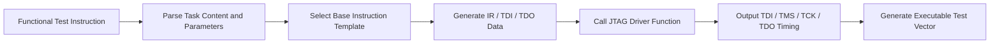

# From Functional Test Instructions to JTAG Vectors: A Template-Based Generation Method

In many chip test, ATE validation, and DFT platform projects, one problem keeps showing up again and again:

**test vector generation becomes heavier and slower as the project moves forward.**

At the beginning, the flow still feels manageable.  
Engineers write a testbench, run simulation, dump waveforms, convert them into WGL or another vector format, and then deliver the result to a test platform.

But once the project enters the middle or late stage, the pain becomes obvious.

A small change such as:

- modifying a register address,
- adjusting one DP or AP access,
- replacing an expected return value,
- or changing the order of debug operations,

often triggers a much larger chain reaction:

- go back to the testbench,
- rerun simulation,
- regenerate waveforms,
- reconvert vectors,
- and validate everything again.

At that point, many teams blame the problem on tools, scripts, or manpower.  
But in many cases, the deeper issue is not any single tool in the flow.

The real issue is this:

> engineers want to express a **test action**, but the flow forces them to first create a **waveform artifact** and only then derive vectors from it.

In other words, the original input is **test intent**, but the center of the process becomes **waveform data**.

That is not a natural abstraction.

So this article explores a more direct question:

## Can we generate JTAG test vectors directly from functional test instructions, instead of treating waveforms as the core intermediate product?

My answer is yes.

And more importantly, this is not just about making the flow faster.  
It is about replacing a waveform-centered flow with a more reusable, scalable, and platform-oriented engineering method.

---

## 1. Why the traditional flow becomes heavier over time

A typical legacy flow looks like this:

1. write the test scenario,
2. write the testbench,
3. run simulation,
4. dump waveforms,
5. convert waveforms into vectors,
6. deliver the vectors to ATE or another test platform.

This flow is not "wrong."  
The issue is that its cost grows rapidly when the project becomes more complex.

It has several structural weaknesses:

### 1.1 Long modification chain

A small test change often requires rerunning a long upstream process.

### 1.2 Heavy dependency on intermediates

The entire flow depends on testbench behavior, simulation outputs, and waveform files.

### 1.3 Test intent and implementation are mixed together

Engineers think in terms of actions such as:

- perform an AP read,
- write to a DP register,
- access an AHB resource,
- compare a returned value.

But the flow forces them to first build waveforms and only later recover the vectors from those waveforms.

### 1.4 Repetitive work grows in late-stage projects

At an early stage, the number of cases is still limited.  
At a later stage, with more cases and more changes, the inefficiency becomes much more visible.

So the real problem is not only that the flow is slow.

The deeper problem is this:

> the flow is organized around **waveforms**, while what engineers really want to express is **test behavior**.

---

## 2. What should be the real input to an automated vector generation system?

In test automation, one of the most important questions is not "how to write scripts," but:

**what should the system take as its native input?**

If the input abstraction is wrong, every optimization afterwards will feel unnatural.

From a functional point of view, a test action can usually be decomposed into two parts.

### 2.1 Task content

This describes **what the test wants to do**.

For example:

- access DP,
- access AP,
- read a register,
- write a register,
- access a target resource through a bus.

### 2.2 Task parameters

This describes **the concrete inputs required by the action**.

For example:

- address,
- write data,
- expected return value,
- port type,
- read/write direction.

Once the input is defined as a **functional test instruction**, the problem becomes much clearer.

The problem is no longer:

> how do we extract vectors from waveforms?

Instead, it becomes:

> how do we translate test intent into protocol transactions, and then into interface timing?

That is a much more natural entry point for automation.

---

## 3. The missing layer between test intent and JTAG vectors

The key is not just a script or a format converter.

The key is a stable intermediate abstraction layer:

**the template layer**

This layer sits between the functional test instruction and the final JTAG vector.

Its job is to map high-level test intent into low-level protocol data.

The full flow can be simplified as follows:


This is the core shift:

- the upper layer is organized around test semantics,
- the middle layer maps semantics to protocol templates,
- the lower layer translates protocol data into interface timing.

Once this template layer becomes stable, many repetitive tasks disappear.

## 4. Why DP/AP read and write operations are the most important base templates

Many debug operations look complicated on the surface:

- accessing a CoreSight component,
- reading or writing a system resource through AHB,
- configuring debug-related registers,
- retrieving a status value.

But when those actions are decomposed further, many of them converge into a few base transactions:

- DP write,
- DP read,
- AP write,
- AP read.

These four templates are important because they form a strong lowest common denominator for many upper-layer operations.

That means:

- upper-layer tasks may be complex,
- lower-layer templates do not need to be complex,
- as long as the base templates are chosen well.

This is very similar to software engineering.

Strong systems are not built by adding endless special cases.  
They are built on top of a small set of stable primitives.

### Base template overview

| Template Type | Purpose | Typical Usage |
|---|---|---|
| DP Write | Write control information to Debug Port | Configure link state, set debug environment |
| DP Read | Read status from Debug Port | Check link state, confirm configuration |
| AP Write | Write data through Access Port | Register write, resource write |
| AP Read | Read data through Access Port | Register read, system resource read |

This template boundary is one of the most important design decisions in the whole method.

## 5. What the template layer actually generates

A template is not just a conceptual description.

It must produce data that can directly drive protocol execution.

From an implementation perspective, the most important outputs are usually:

- `ir_data`
- `tdi_data`
- `tdo_data`

### 5.1 ir_data

This represents the instruction register value required by the current operation.

For example:

- DP access maps to one IR value,
- AP access maps to another IR value.

### 5.2 tdi_data

This represents the input data sequence to be shifted into the chain.

It is usually composed from:

- read/write flag,
- address bits,
- data bits,
- other protocol control fields.

### 5.3 tdo_data

This represents the expected output data, or the target value used for comparison.

This part is critical.

Test vector generation is not only about sending bits into the chain.  
It also has to describe what the system is expected to return.

So the real function of the template layer is not string replacement.

It is this:

> convert a functional test instruction into a standardized protocol transaction.

## 6. Why templates are really protocol knowledge turned into code

Anyone who has written JTAG test procedures by hand will recognize the same repetitive work:

- determine whether this is a DP or AP operation,
- choose the correct IR value,
- build the TDI sequence,
- place address bits and data bits in the right format,
- prepare the expected return value,
- hand everything over to a state-machine-driven shifting process.

In many teams, this knowledge is scattered across:

- senior engineers' experience,
- old scripts,
- temporary notes,
- or undocumented conventions.

A template-based method turns that hidden knowledge into explicit and executable rules.

A simplified pseudo-logic may look like this:

```text
if op == DP_WR:
    ir_data  = DPACC
    tdi_data = {write_data, addr, write_flag}
    tdo_data = expected_tdo

if op == DP_RD:
    ir_data  = DPACC
    tdi_data = {dummy_data, addr, read_flag}
    tdo_data = expected_read_value

if op == AP_WR:
    ir_data  = APACC
    tdi_data = {write_data, addr, write_flag}
    tdo_data = expected_tdo

if op == AP_RD:
    ir_data  = APACC
    tdi_data = {dummy_data, addr, read_flag}
    tdo_data = expected_read_value
```

The logic itself is not visually complicated.

Its value comes from the fact that things that were previously decided ad hoc are now encoded as stable, reusable engineering rules.

That is where platform capability begins.

## 7. Why the JTAG driver layer is just as important as the template layer

At this point, it may feel like the problem is already solved.

It is not.

Because the final output consumed by a test platform is not abstract data such as `ir_data`, `tdi_data`, or `tdo_data`.

The platform needs actual interface timing:

- `TDI`
- `TMS`
- `TCK`
- `TDO`

That means the system still needs one more essential layer:

**the JTAG driver layer**

These two layers solve different problems.

### Template layer

This answers:

> what data should be sent for this operation?

### Driver layer

This answers:

> in which state, at which time, and in which order should that data be sent?

These are closely related, but they are not the same thing.

One is about semantic mapping.  
The other is about timing realization.

Only when these two layers are separated does the architecture become clean and maintainable.

## 8. Why the JTAG state machine is the real landing point of the whole method

JTAG is not simply a matter of pushing zeros and ones through pins.

It is fundamentally a state-machine-driven serial access mechanism.

So the path from template data to final vector usually looks like this:

- determine the IR content required by the current operation,
- use TMS to move the TAP controller into IR-related states,
- shift the IR data in under TCK,
- move to DR-related states,
- shift `tdi_data` into the chain in protocol format,
- sample or compare TDO at the correct moments,
- generate the final executable timing vector.

The most important distinction here is:

> the template layer outputs the meaning of the operation, while the driver layer outputs the timed physical execution of the operation.

Many unstable systems fail precisely because these two responsibilities are mixed together.

## 9. What actually happens between a test goal and the final interface vector

The whole flow can be viewed as a multi-stage translation process.

### Layer 1: test goal

For example:

- access a target address,
- read a register,
- verify a returned status value.

### Layer 2: functional test instruction

The goal is expressed as structured input, such as:

```text
task_name: jtag_ahb_ap_read_data
addr: 32'h200100c4
expect_rdata: 32'h5a5a5a5a
```

### Layer 3: template mapping

The system recognizes this as an AP read operation, possibly together with required DP-side control steps.

### Layer 4: protocol data generation

For example:

```text
ir_data  = APACC
tdi_data = {dummy_data, addr_field, read_flag}
tdo_data = expected_rdata
```

### Layer 5: state-machine-driven execution

The driver determines:

- what TMS should be at each step,
- which TCK sequence is used for IR shifting,
- which sequence is used for DR shifting,
- and when TDO should be sampled or compared.

### Layer 6: final vector output

The system generates executable JTAG timing vectors for the target test platform.

This is the most interesting shift in the entire method:

> the final vector is not manually drawn from waveforms; it is derived from test intent through structured translation.

## 10. Why this method is more suitable for engineering than waveform-first flows

Many ideas sound elegant but are not necessarily practical.

This method is practical because it matches how real engineering teams work under continuous change.

### 10.1 Lower modification cost

In traditional flows, changing one action may require going back through testbench and waveform regeneration.  
In a template-based flow, many changes stay at the instruction and parameter level.

### 10.2 Stronger reusability

Once base templates are stable, many upper-layer scenarios can reuse them.  
Engineers do not need to rebuild low-level access behavior from scratch.

### 10.3 Better platformization

When templates, driver logic, and protocol rules are all formalized, the capability becomes a team asset rather than the skill of a single expert.

### 10.4 Better alignment with ATE consumption

ATE cares about:

- executable vectors,
- interface timing,
- expected response.

It does not care whether a waveform file was used as an intermediate artifact.

### 10.5 Easier long-term extension

Once the DP/AP/JTAG chain is connected, many complex actions become a matter of template composition rather than ad hoc reinvention.

## 11. The real value is not "fewer steps" but a different generation paradigm

It is tempting to see this as merely an optimization of the old flow.

But the change is deeper than that.

The difference is:

- the traditional flow is waveform-centered,
- the template-based flow is test-semantics-centered.

That is not just a difference in the number of steps.  
It is a difference in the system's core abstraction.

In complex projects, the most stable thing is usually not a waveform.

The most stable thing is:

> what the test action is supposed to accomplish.

Once that becomes the center of the system, the entire architecture becomes easier to scale.

## 12. A four-layer view of the whole framework

This method can be understood as a four-layer framework.

### Layer 1: test task layer

Describes what the test intends to do.

### Layer 2: template mapping layer

Converts test tasks into standardized protocol transactions.

### Layer 3: JTAG driver layer

Converts protocol transactions into state-machine-driven interface execution.

### Layer 4: vector output layer

Generates final vector data for the target platform.

This layered architecture matters because it allows continuous extension:

- the upper layer can support more kinds of test intent,
- the middle layer can support more protocol templates,
- the lower layer can support more vector output formats,
- and the whole system does not collapse when one layer evolves.

From this perspective, the method is no longer just a "vector generation script."

It becomes part of a reusable test infrastructure.

## 13. Final thoughts: understand the action first, generate the waveform later

A major dividing line in chip test automation is this:

> do you treat the waveform as the center of the flow, or do you treat the test action as the center?

If waveforms remain the core artifact, the flow naturally becomes heavier, more fragile, and more dependent on repeated manual work.

But if the system is organized around test actions, templates, and protocol-driven execution, then waveform-level timing becomes an output rather than the starting point.

In other words:

> the waveform should be the implementation result of a test action, not the primary vehicle for expressing that action.

That is the core idea behind:

**from functional test instructions to JTAG vectors**

This is not merely a small scripting trick.

It is a more natural engineering method for long-term evolution in chip test automation, ATE adaptation, and verification infrastructure development.

## 14. Discussion

How does your team generate test vectors today?

### Option A

`testbench -> simulation -> waveform -> vector`

### Option B

`test instruction -> template mapping -> protocol driver -> vector`

In many teams, inefficiency does not come from lack of effort.  
It comes from the fact that the generation logic takes an unnecessarily indirect path.

