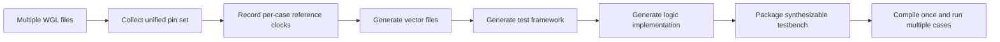

# Why Merging Multiple WGLs into One Synthesizable Testbench Improves Verification Throughput

## Abstract

In many verification environments, the main bottleneck is not the speed of a single simulation run. The bigger problem is the repeated cost of generating, compiling, loading, and switching between many small testbench instances. That cost becomes especially painful when WGL-based test patterns are handled one by one.

A better approach is to merge multiple WGL files into a single **synthesizable testbench package** so that more test cases can share the same compiled execution framework. This changes the optimization target from **single-run speed** to **end-to-end throughput**.

This article explains why that architectural shift matters, what must be unified in the merged flow, and why the real value is not file concatenation but execution-model redesign.

---

## 1. The real problem is usually throughput, not raw run speed

When teams say a verification flow is slow, they often mean one of the following:

- simulation takes too long
- vectors are too large
- there are too many test cases
- emulation resources are expensive

All of those can be true. But in practice, a large part of the delay often comes from something less visible:

> the same verification workload is split into too many expensive start-stop cycles.

For a WGL-driven flow, a traditional pattern often looks like this:

1. take one WGL file
2. generate one synthesizable testbench
3. compile it
4. run it
5. switch to the next WGL and repeat the whole process

That model may be acceptable when the number of patterns is small. It becomes increasingly inefficient once the workload scales.

The key point is simple:

**Verification throughput is shaped not only by execution speed, but also by how often the flow pays fixed setup costs.**

---

## 2. Why the one-WGL-one-testbench model becomes inefficient

A one-WGL-one-testbench flow is intuitive, but it scales poorly for at least three reasons.

### 2.1 Repeated compilation cost

Hardware acceleration and large-scale simulation flows are often dominated by expensive front-end steps:

- elaboration
- synthesis-oriented preparation
- framework generation
- compilation and load

If each WGL file becomes an isolated run unit, the flow keeps paying those costs again and again.

This is exactly why single-pattern conversion flows create a throughput ceiling: the platform spends too much time preparing to run and not enough time actually running useful verification.

### 2.2 Fragmented platform utilization

Acceleration platforms usually perform best when a large amount of work shares the same execution context.

If patterns are split into many small independent tasks, the platform is forced into a fragmented rhythm:

- prepare
- run briefly
- unload
- switch context
- prepare again

The result is poor sustained utilization.

### 2.3 Operational complexity grows too fast

As the number of WGL files increases, the workflow also accumulates management overhead:

- more generated files
- more compile artifacts
- more mapping between patterns and testbench instances
- more effort to rerun, reproduce, and debug failures

So the issue is not only that the flow runs slowly. It is that the **organization model itself becomes too heavy**.

---

## 3. The optimization target should be the execution unit

If the expensive part of the platform is **compiling and loading a synthesizable testbench**, then the most valuable optimization is usually not shrinking a single pattern.

It is this instead:

> allow more test cases to share the same compiled execution framework.

That is why merging multiple WGL files into one synthesizable testbench matters.

The goal is not merely to reduce the number of files. The real goal is to redefine the run unit from:

- one WGL = one compile = one run

into:

- many WGLs = one package = one compile = many runs inside the same framework

This is a throughput optimization at the architectural level.

---

## 4. What “merging multiple WGLs” really means

This approach is often misunderstood as file concatenation. In practice, it is much more than that.

A merged synthesizable testbench flow typically has to do the following:

1. parse all WGL files in the test set
2. collect the full pin set across all test cases
3. generate a unified hardware interface file
4. record reference clock information for each test case
5. generate vector files that encode per-case stimulus and expected responses
6. generate the test framework file
7. generate the framework logic implementation file
8. package everything into one synthesizable testbench bundle

A compact view looks like this:

The key change is not cosmetic. The **execution model** changes.

---

## 5. Why throughput improves after merging

The throughput gain is real, but it is easy to explain it too narrowly. It is not just “because compilation happens fewer times,” although that is one major factor.

The full reason is a combination of multiple effects.

### 5.1 Fixed costs are amortized

Once hardware interface generation, framework generation, and synthesizable logic preparation are done once for a larger batch of test cases, the fixed preparation cost is spread across many patterns.

That changes the economics of the flow.

### 5.2 Fewer load and context-switch cycles

A merged package reduces the number of times the platform has to:

- load a new top-level environment
- initialize the same execution framework again
- rebuild equivalent context for another nearby test case

This matters in both emulator-based flows and large simulation infrastructures.

### 5.3 The platform stays in a more continuous execution rhythm

Instead of repeatedly starting short independent jobs, the flow can execute more cases under one stable framework. That improves sustained utilization and reduces dead time between useful runs.

### 5.4 Debug and regression management become cleaner

A more structured execution unit also helps with:

- regression scheduling
- artifact management
- failure localization
- rerun consistency

In other words, the benefit is not only runtime efficiency. It is also operational simplicity.

---

## 6. What must be unified in a merged synthesizable testbench

The approach only works if the merged package is designed with the right abstractions. At minimum, several layers must be unified.

### 6.1 A unified hardware interface

All pins that may appear across the full WGL set must be collected into a single hardware interface description.

This is important because the flow should no longer redefine the top-level boundary for every individual test case.

Instead, it should define:

- one stable DUT-facing interface
- one stable framework boundary
- many test cases running inside that same boundary

This is what makes a single compilation result reusable.

### 6.2 A unified reference-clock description

Different WGL files may use different reference clocks or frequency combinations. A merged flow needs a structured way to record, per test case:

- which reference clocks are used
- how those clocks are indexed
- how those indexes map to frequencies in the framework logic

Without this layer, multiple test cases cannot safely share the same execution framework.

### 6.3 A unified vector organization model

A usable vector file must carry more than raw values. It also has to encode control information such as:

- which test case is currently active
- where a test case starts and ends
- which input pins are valid in a given step
- which output comparisons are valid in a given step

That turns vector files into structured execution data, not just value dumps.

---

## 7. The hard part is not packaging files, but building one common timing world

This is where the problem becomes technically interesting.

A merged flow is not useful unless it preserves the original timing semantics of each test case.

That means the flow must handle at least two difficult issues:

- **different timing precisions across WGL files**
- **different per-pin timing offsets across patterns**

A practical implementation therefore needs a timing normalization strategy.

For example:

- choose the finest time scale among all WGL files as the common time base
- analyze all pin timing offsets
- generate offset variables or pulse points for distinct timing offsets
- drive stimulus and sample responses based on those normalized offset events

This is the difference between a flow that merely merges data and a flow that preserves executable semantics.

---

## 8. Dynamic pin direction is another reason this is non-trivial

Real test content is not always direction-stable.

A pin that acts as an input in one pattern may behave like an output in another. That makes a naive merge unsafe.

A robust merged testbench package therefore needs explicit direction-aware vector modeling, usually by:

- separating input-oriented and output-oriented vector organization
- carrying validity bits for pin participation
- letting the runtime framework switch behavior by test case

This is one reason a merged flow is far more than a batch file operation. It is really an execution framework for heterogeneous test cases.

---

## 9. Why this matters for hardware acceleration

A synthesizable testbench is the bridge between pattern-oriented test content and acceleration-oriented execution.

If that bridge only supports one WGL at a time, the flow leaves a large part of the acceleration platform’s value on the table.

If the bridge can package many test cases into one reusable compiled environment, then the platform can finally behave like a throughput machine rather than a repeatedly restarted single-case runner.

That is why this topic belongs to infrastructure design, not just file conversion.

---

## 10. A useful mental model: this is a batching problem disguised as a conversion problem

At first glance, the topic looks like a format-conversion problem:

- convert WGL
- generate synthesizable files
- run them

But at a deeper level, it is actually a batching problem.

The important question is not:

> can one WGL be converted?

The more important question is:

> how should many WGL-based test cases be grouped so that the expensive execution environment is reused efficiently?

Once the problem is framed that way, the architectural direction becomes much clearer.

---

## 11. Key takeaways

- The main bottleneck in large WGL-driven flows is often repeated setup cost, not just runtime speed.
- One-WGL-one-testbench scales poorly because it repeats compilation, load, and execution-context creation.
- Merging multiple WGLs into one synthesizable testbench changes the run unit from isolated jobs to batch-oriented execution.
- The real value comes from reusing one compiled framework across many test cases.
- A correct implementation requires unified handling of pins, clocks, vector organization, timing precision, timing offsets, and dynamic pin roles.
- This is best understood as a verification infrastructure capability, not a simple file-processing script.

---

## 12. Conclusion

Merging multiple WGL files into one synthesizable testbench improves verification throughput because it attacks the real cost structure of the flow.

It reduces repeated compilation. It reduces repeated platform setup. It increases execution continuity. It simplifies management. Most importantly, it redefines the execution unit in a way that is aligned with how acceleration platforms actually deliver value.

So the core idea is not:

> combine files to save effort.

The real idea is:

> build one reusable execution framework so more test cases can share the same expensive preparation result.

That is why this direction is worth treating as a platform-level method rather than a local optimization.

---

## Next article

**What are the core building blocks of a synthesizable testbench package?**

That is the natural next step, because once multiple WGLs are merged into one execution framework, the next question becomes:

- what exactly is inside that package?
- which parts are structural?
- which parts are timing-related?
- which parts are vector-related?
- which parts make multi-case execution actually work?
