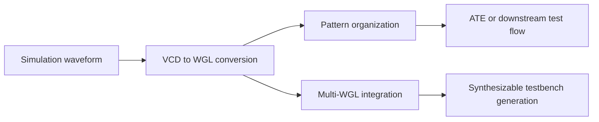

# Why VCD->WGL Scripts Eventually Need to Be Rebuilt as C++ Tools

Part of the **Chip Test Automation & Verification Infrastructure** series.

Most engineering tools do not start life as tools.

They start as scripts.

**VCD -> WGL** is a classic example.

A team has a waveform dump.  
Someone needs a pattern file.  
A quick Python script is written.  
It works on one case.  
Then it gets extended for another case, then another, then another.

A few months later, everybody knows the same uncomfortable fact:

> **The script works, but nobody wants to touch it too much.**

That is usually the turning point.

The issue is not that scripting was the wrong choice at the beginning.  
The issue is that the problem has grown from a **script task** into a **tool problem**, while the implementation is still being treated like an ad hoc script.

That mismatch is where maintainability starts to collapse.

---

## Why the First Version Is Usually a Script

This is not a mistake.  
It is often exactly the right move.

Scripts are good at the early stage because they are excellent for:

- trying out parsing logic quickly
- validating one conversion path
- iterating on output format
- handling text-heavy data with minimal overhead
- exploring uncertain rules without too much up-front structure

When the converter is still being discovered, the most important question is:

> Can we get one real case to work?

At that moment, a script is often the fastest path.

So the real issue is not:

> Why did we start with Python?

The real issue is:

> **At what point did the converter stop being "just a script"?**

---

## The Warning Signs That the Script Is No Longer Just a Script

There are some very consistent signals.

### 1. The number of cases keeps growing

The first implementation may assume:

- one working clock
- one pad style
- one output format
- one project-specific convention

Then reality expands:

- multiple clock situations
- different pad naming schemes
- multiple vector organizations
- different downstream compatibility requirements

Now the logic starts branching.

### 2. Special cases keep accumulating

Examples include:

- one project samples on the falling edge
- one group of pads needs a special order
- one bus must be expanded differently
- some signals need glitch filtering
- some outputs should preserve `x`
- some values should become masked or don't-care

Each case is understandable by itself.  
The problem is the accumulation.

### 3. Nobody wants to refactor it

This is the most serious sign.

The code may still produce output, but the engineering behavior changes:

- people prefer adding one more `if`
- nobody is sure what an old rule depends on
- historical cases feel too risky to disturb
- internal state becomes increasingly implicit

At that point, the script has already become a small system.  
It simply does not look like one yet.

---

## Why VCD->WGL Tends to Grow Into a System

Because it looks narrow from the outside, but touches several different layers inside.

A practical converter usually needs to deal with:

### 1. Input parsing
- VCD parsing
- pad information parsing
- optional configuration or metadata loading

### 2. Clock and time behavior
- working clock selection
- active edge choice
- timescale interpretation
- cycle partitioning

### 3. Sampling semantics
- event reduction
- glitch handling
- unknown and high-impedance treatment
- multiple changes inside a cycle

### 4. Pad organization
- signal-to-pad mapping
- input/output/inout classification
- bus expansion
- stable ordering

### 5. Vector modeling
- drive values
- compare values
- valid-bit semantics
- pattern step construction

### 6. Output emission
- WGL formatting
- metadata sections
- downstream compatibility constraints

That is already much more than "read one file and write another."

It is a small infrastructure component.

---

## The First Thing That Usually Breaks Is Not Functionality, but Maintainability

A fragile script can still generate output.

That is why teams often keep it alive longer than they should.

The first serious damage is usually elsewhere:

### Structural clarity disappears
Parsing logic, sampling logic, and output logic get mixed together.

### Rules become implicit
The system starts relying on hidden defaults, such as:

- this signal is assumed to be the clock
- this class of pads is assumed to be outputs
- this category of transitions is assumed to be irrelevant
- this project is assumed to follow the same policy as the last one

### Regression becomes difficult
Every change raises the same fear:

- did we break an old case?
- did a project-specific workaround stop working?
- are the sample points still identical?
- did one small timing fix alter a historical pattern?

When these fears become normal, the code is telling you that the architecture is too loose.

---

## Why Teams Often End Up Choosing C++

This is not about claiming that C++ is always the correct language.

The deeper point is this:

> Once the converter becomes a long-lived engineering capability, the implementation needs stronger control over complexity.

C++ is often chosen because it encourages that control in very practical ways.

### 1. Clear module boundaries

A healthier architecture might separate components like:

- `VcdParser`
- `PadMapParser`
- `ClockSelector`
- `Sampler`
- `VectorBuilder`
- `WglWriter`

Once the boundaries are explicit, the system becomes easier to reason about.

### 2. More explicit data structures

Ad hoc scripts often carry logic through:

- loosely shaped dictionaries
- temporary tuples
- mutable global state
- implicit field meanings

As the system grows, the model needs stronger shape, such as:

- `SignalEvent`
- `PadInfo`
- `SamplePoint`
- `PatternVector`
- `ConversionConfig`

Making those structures explicit forces hidden rules into the open.  
That is a major engineering advantage.

### 3. Better long-term control

A more tool-oriented implementation benefits from:

- compile-time checks
- stronger interfaces
- easier ownership boundaries
- more predictable large-file processing
- more natural integration with regression and build systems

That is often why a converter eventually gets rebuilt in C++ rather than endlessly patched in script form.

---

## The Real Refactor Is About Architecture, Not Language

One of the most common mistakes is to treat refactoring as literal translation.

That usually looks like this:

- keep the same global variables
- keep the same tangled control flow
- keep the same special-case structure
- just rewrite the syntax in C++

That produces a worse outcome than expected:

> **the same old system, but harder to edit**

A real refactor starts with different questions:

- what are the true input boundaries?
- what is the internal data model?
- where does sampling policy belong?
- how should configuration be separated from logic?
- which parts need deterministic regression coverage?
- which outputs should be treated as golden references?

That is why the real transition is not:

> Python -> C++

It is:

> **script mindset -> tool mindset**

---

## A Better Tool-Oriented Architecture

If I were rebuilding a VCD->WGL converter as a maintainable tool, I would split it into six layers.

### 1. Input layer
Responsible for loading:

- VCD files
- pad information
- conversion configuration
- user parameters

### 2. Parsing layer
Responsible for turning raw input text into structured representations:

- signal definitions
- timestamped events
- pad metadata
- mapping information

### 3. Clock and sampling layer
This is the core layer.

Responsible for:

- choosing the working clock
- defining the active edge
- establishing sample windows
- reducing waveform activity into stable per-cycle meaning

### 4. Vector modeling layer
Responsible for:

- constructing per-sample pad values
- distinguishing drive values from compare values
- handling `x/z` semantics
- generating pattern-level vector objects

### 5. Output layer
Responsible for:

- writing WGL
- organizing sections and metadata
- supporting format variants where needed

### 6. Validation layer
Responsible for:

- golden case comparison
- regression testing
- boundary-condition verification
- confidence across refactors

That structure makes the system look much more like what it already is: a real tool.

---

## Why Testability Matters More Than "It Can Convert"

During the prototype phase, success means:

> it can generate output for a real case

During the tool phase, success changes into something much stricter:

> it can evolve without silently corrupting historical behavior

That requires validation.

At minimum, a serious converter should support two kinds of checks.

### Sample-based regression
Given fixed inputs:

- VCD
- pad info
- config

the generated output should be compared against a known-good result.

### Semantic validation
Not just "the text file matches," but also:

- were the correct sample points used?
- was the correct clock selected?
- did critical pads get captured at the expected steps?
- did boundary conditions remain stable?

Without those protections, the system becomes increasingly risky to modify.

---

## Why This Matters Beyond One Converter

A VCD->WGL converter is rarely the real endpoint.

It often sits in the middle of a larger chain:

Once that is true, the converter is no longer a convenience script.  
It is an infrastructure node.

That changes the standard it must meet.

A fragile script may be acceptable for a one-off experiment.  
It is much less acceptable as a dependency for:

- repeated pattern generation
- project-to-project reuse
- testbench assembly
- acceleration-oriented flows
- regression-sensitive downstream consumers

---

## A Practical Principle

There is nothing wrong with starting with a script.

The mistake is continuing to treat a long-lived tool like a disposable script.

For VCD->WGL, that turning point often arrives as soon as the converter must handle:

- multiple projects
- multiple waveform conventions
- real regression requirements
- stricter pad organization
- stable sampling rules
- downstream integration expectations

At that point, rebuilding as a real tool is not overengineering.  
It is overdue engineering.

---

## Conclusion

Most **VCD->WGL** efforts begin as scripts for good reasons:

- they are fast
- flexible
- easy to iterate
- ideal for early uncertainty

But the problem eventually grows.

Once the converter must carry:

- clock logic
- sampling policy
- glitch handling
- pad abstraction
- vector semantics
- format stability
- regression confidence

it has already become more than a script.

That is why many such flows eventually move toward a C++ tool implementation.

Not because changing languages is inherently valuable,  
but because the system needs:

- explicit boundaries
- explicit data models
- stronger maintainability
- better regression protection
- more stable long-term engineering behavior

In the next article, I will place this tool back into the larger flow:

# VCD->WGL Is Not the End: How It Connects to ATE, Multi-WGL Integration, and Synthesizable Testbench Flows

If this article focuses on **why toolization becomes necessary**,  
the next one focuses on **where this tool actually sits in the broader automation pipeline**.
