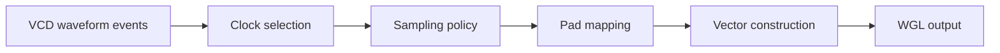

# VCD to WGL: The Hard Part Is Not Format Conversion, but Sampling

Part of the **Chip Test Automation & Verification Infrastructure** series.

At first glance, **VCD -> WGL** looks like a file conversion task.

You have a VCD waveform dump.  
You need a WGL pattern file.  
So the obvious assumption is: parse one format, print another.

That assumption is exactly why many early implementations look easy and later become fragile.

The real difficulty is not the text format.  
The real difficulty is this:

> **At which moments should a continuous waveform history be turned into discrete test vectors?**

That is a sampling problem, not a formatting problem.

Once you see that, the structure of the whole toolchain becomes clearer.

---

## Why VCD -> WGL Is Easy to Underestimate

A lot of engineering work gets underestimated when the input and output are both text files.

VCD is text.  
WGL is text.  
So it is tempting to think the middle is just text processing.

But VCD and WGL describe very different things.

### What VCD really represents

VCD is primarily an **event log**.

It records:

- when a signal changes
- what value it changed to
- how the simulation evolved over time

It is designed to preserve waveform history.

### What WGL really represents

WGL is primarily a **test execution artifact**.

It needs to express:

- what values should be driven at a test step
- what values should be expected or compared
- how vectors should be organized for downstream test execution

It is designed to preserve **test intent at discrete execution points**.

That difference matters.

VCD says: *this signal changed here, and then here, and then here again.*  
WGL says: *at this vector step, these pins should mean these values.*

So the central task is not "format translation."  
The central task is:

> **How do we compress waveform events into meaningful vector samples?**

---

## From Waveform History to Test Vectors

Once the problem is framed correctly, the flow looks more like this:

The formatting layer is at the end.

The difficult part happens earlier:

- choosing the correct working clock
- deciding the sampling edge
- resolving multiple changes within a cycle
- filtering irrelevant waveform details
- mapping simulation signals to final pads or pins
- determining whether a value is a drive value or an expected response

That is why a converter that "works on a demo case" can still fail badly on real production patterns.

---

## The First Real Problem: What Is the Working Clock?

The first serious design decision is almost always this:

> **Which clock defines the vector cadence?**

In a realistic design, the waveform may contain:

- a primary functional clock
- asynchronous clocks
- divided clocks
- interface clocks
- debug clocks
- internal derived clocks

Without a clear **working clock**, there is no stable notion of a vector step.

The working clock determines:

- when a sample should be taken
- how one cycle is defined
- how intra-cycle events are grouped
- when a signal should be interpreted as input stimulus or output observation

Without that anchor, the waveform is just activity.  
With it, the waveform starts to become a **test process**.

---

## Rising Edge or Falling Edge Is Not a Minor Detail

Sampling edge selection is often treated like an implementation detail.

It is not.

It changes the meaning of the generated vectors.

Suppose an input is intended to be stable before the active edge, and an output becomes valid after that edge.  
If the tool samples at the wrong moment, the generated vectors may mix setup behavior, transitional behavior, and response behavior into the same step.

The output may still look syntactically correct.  
But it no longer represents the intended test semantics.

That is why "which edge do we sample on?" is not just a coding question.  
It is a **behavior definition** question.

---

## Why Glitches Become a Real Engineering Problem

VCD is faithful to simulation activity.

That includes transient transitions, narrow pulses, and other short-lived waveform details that may be completely valid in a simulation log.

But a vector generator cannot blindly preserve every observed event.

Test vectors are not meant to replay raw waveform noise.  
They are meant to represent **meaningful execution states**.

So a converter must answer questions like:

- should every transition inside a cycle be preserved?
- should a narrow pulse be treated as meaningful or ignored?
- if a signal toggles multiple times within a sample window, which value wins?
- when should an unknown state be preserved, masked, or turned into don't-care behavior?

This is why glitches are not cosmetic waveform details.  
They are part of vector quality.

A large class of VCD -> WGL failures do not come from broken syntax generation.  
They come from **missing or inconsistent sampling policy**.

---

## Pad Mapping Is More Than a Name Lookup

Another area that gets underestimated is **pad mapping**.

A converter usually needs to bridge two views:

- the simulation view of the design
- the test platform view of pads or pins

That bridge is rarely trivial.

Common complications include:

- simulation names do not exactly match pad names
- buses need to be expanded in a defined bit order
- some signals are internal and should never become pattern pins
- some pads may be inputs in one context and outputs in another
- ordering rules need to remain stable across runs

In other words, pad mapping is not just a convenience step.  
It is a structural layer that translates **design-side observation** into **test-side vector organization**.

If that layer is loose or implicit, the output may look fine while still being semantically unstable.

---

## The Output Writer Is Usually Not the Hardest Part

Many people assume the final WGL writer is the most difficult component.

Usually it is not.

If the earlier layers are clearly defined:

- working clock selection
- edge policy
- sample window behavior
- glitch handling
- pad mapping
- value semantics
- vector organization

then writing the output file is mostly formatting work.

That does not mean formatting is unimportant.  
It means the output layer is downstream of the real logic.

The critical question is not:

> Can the tool print a legal WGL file?

The critical question is:

> Do the values in that WGL file actually represent the intended test state at the intended sample point?

---

## A Better Way to Think About the Problem

The most useful mental model is to treat VCD -> WGL as a stack of models:

### 1. Clock model
- which clock defines vector cadence
- how cycles are partitioned
- how multiple clocks are handled

### 2. Sampling model
- which edge is active
- what the sample window is
- how multiple events within a cycle are reduced

### 3. Pad model
- which signals become pads
- how inputs, outputs, and inouts are classified
- what ordering is fixed

### 4. Value semantics model
- how `0/1/x/z` should be interpreted
- which values are drive values
- which values are compare values
- when values should be masked

### 5. Output model
- how vectors are organized
- how metadata is attached
- how the final WGL is emitted

Once the converter is seen this way, it becomes obvious that the real system is larger than a simple script filter.

---

## Why This Matters for Engineering Practice

Misclassifying the problem leads to the wrong implementation priorities.

If a team thinks VCD -> WGL is just format conversion, it will focus on:

- string parsing
- header generation
- output syntax
- special-case patching

If a team understands that the problem is really about sampling semantics, it will instead focus on:

- clock definition
- edge policy
- event reduction
- pad abstraction
- vector data modeling
- regression stability

That second path is slower at the beginning, but much more stable in the long run.

---

## A Useful Rule of Thumb

Before asking:

> How do we convert this VCD to WGL?

ask:

> **At which moments do values become meaningful test vectors?**

That single question tends to clarify the rest of the architecture.

If the answer is vague, the converter will almost certainly turn into a long sequence of fragile patches.

If the answer is precise, the WGL writer becomes just the last step in a much better-defined flow.

---

## Conclusion

The core of **VCD -> WGL** is not file translation.

It is:

> **sampling continuous waveform behavior into discrete vector meaning**

That is why the difficult parts are not usually in the final output syntax.  
They are in the sampling model:

- working clock selection
- active edge definition
- glitch and intra-cycle event handling
- pad mapping
- value interpretation
- vector construction

Once those are modeled well, the output becomes much more stable.

In the next article, I will move one step further and discuss a very practical engineering question:

# Why VCD->WGL Scripts Eventually Need to Be Rebuilt as C++ Tools

If this article clarifies **what the real problem is**,  
the next one focuses on **why prototype scripts often stop being enough** and what a more tool-oriented architecture should look like.
